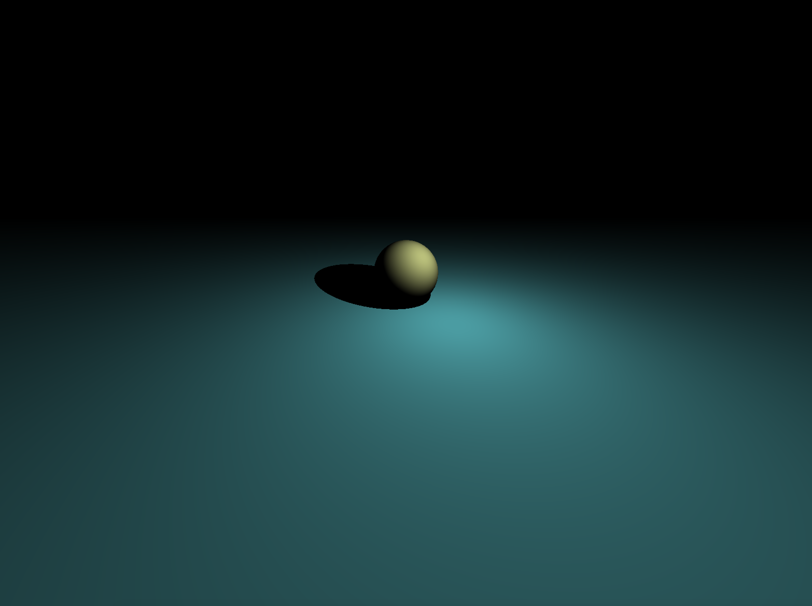
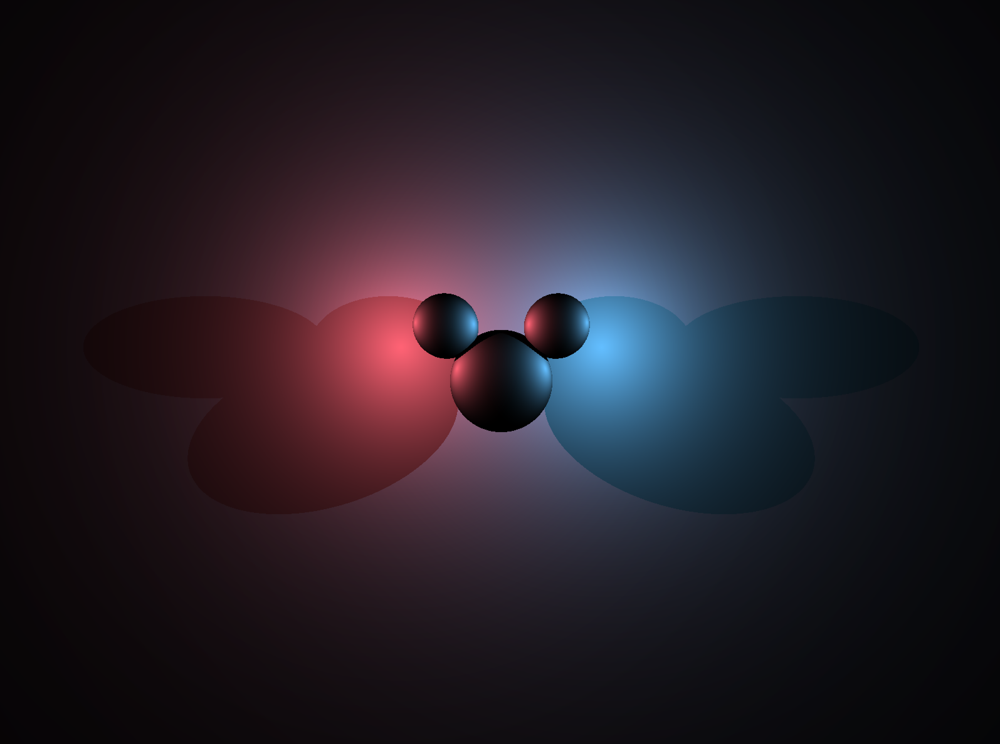
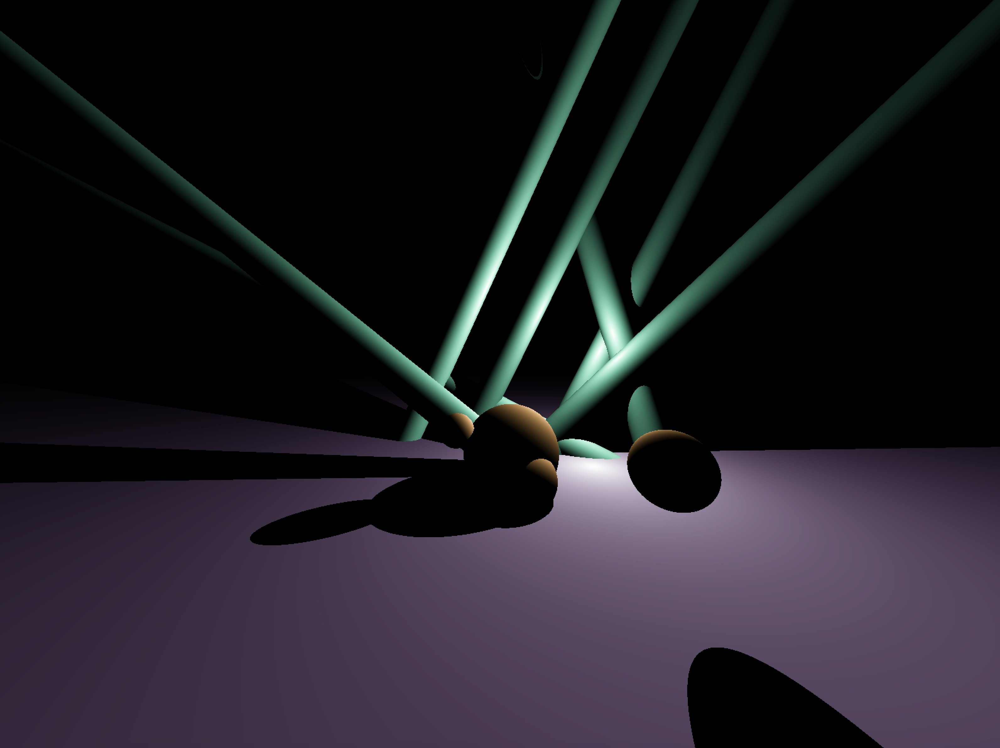

# 42-SimpleRaytracer
A raytracing engine that loads customizable maps.
Includes squares, planes, spheres, cones, cylinders, lights, colored lighs.

This project was made with Conan Wu, check out her github (conanwu777) if you haven't already. 
 
 ## starting the program
 
 ```make``` will compile, ```./rtv1 scenes/[CHOOSE_ANY]``` will run the program
 
 ## input
 
 Arrow keys to move.
 
 space to change lighting mode.
 
 WASD to rotate camera.
 
 < and > to move forwards and backwards.
 
 ## Screenshots
 





 
 
